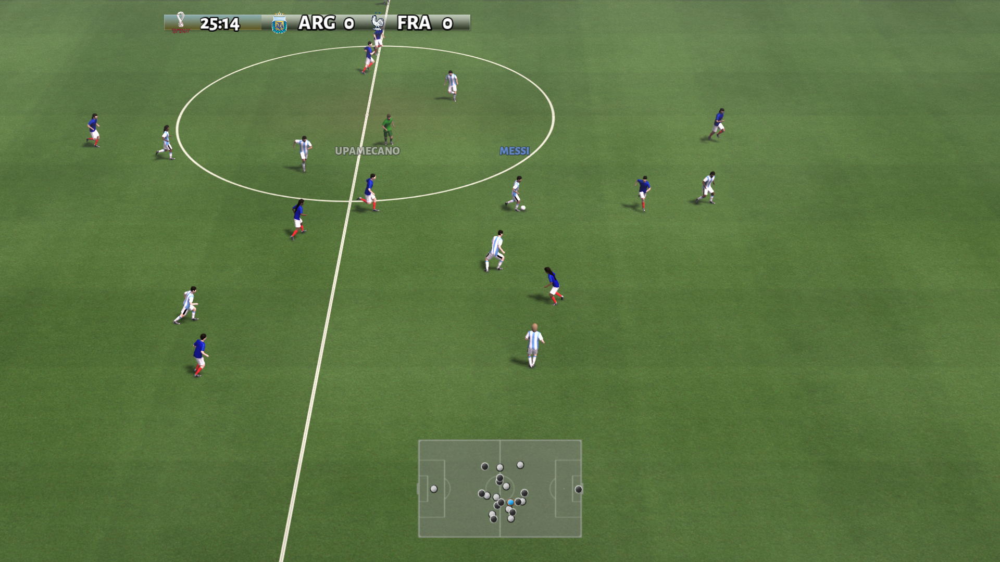

# Football Commentator

Automatic football commentary generation using natural language processing.

<div align="center">

</div>

# Overview

This repository contains the football-commentator project, which aims to generate real-time commentary for football matches using natural language processing techniques and distributed computing

 This system was developed as the final project for the **I400 Natural Language Processing** course at [Universidad de San Andrés](https://www.udesa.edu.ar/), Argentina, during the first semester of 2025.

 Group members:
- Marcos Piotto (mpiotto@udesa.edu.ar)
- Segundo Santos Torrado (ssantostorrado@udesa.edu.ar)
- Ignacio Schuemer (ischuemer@udesa.edu.ar)
- Santiago Tomas Torres (storres@udesa.edu.ar)

# Architecture

<div align="center">

</div>

The architecture of the football-commentator project is designed to handle real-time data processing and commentary generation on consumer-grade GPU hardware. It consists of the following three main components:

- **Event Extractor:** it uses a modified version of the [Google Research Football](https://github.com/google-research/football) reinforcement learning environment to extract events from football matches. The purpose of this module is to capture key events such as passes, shots, and goals from the raw observations and actions data provided by the environment.

- **Event To Text:** this module converts the extracted events into natural language text. It uses either GPT-4.1 nano or a local Gemma 3 model fine-tuned on the former's outputs to generate coherent and contextually relevant commentary based on the events extracted by the Event Extractor.

- **Text To Speech:** the final module converts the generated text commentary into speech. It uses a fine-tuned version of [Coqui TTS](https://github.com/coqui-ai/TTS) multi-speaker xTTSv2 model. The starting model was already a fine-tuned version of the xTTSv2 model on Argentinian Spanish data ([marianbasti/XTTS-v2-argentinian-spanish](https://huggingface.co/marianbasti/XTTS-v2-argentinian-spanish)), and it was further adapted using a small dataset of transcribed argentine football commentary. 

In order to allow the football-commentator app to run in real-time on consumer-grade hardware, the modules are designed to be executed on separate machines, each with its own GPU. Therefore, a hosted **Discovery** module is included to facilitate the identification between the different components of the system. Once the modules are running and connected with each other, they continue to communicate and exchange data through the LAN network by using the [gRPC](https://grpc.io/) protocol.

Additionally, an **Audio Player** module is included to play the generated audio commentary. This module can be run on the same machine as the Event Extractor or on a separate machine, depending on the user's preference.

# Installation

Each module of the football-commentator project is packaged as a separate Python package, with its own dependencies and requirements.

- **Discovery:** to install the Discovery module, run the following command:

```bash
pip install football-commentator-discovery
```

- **Event Extractor:** to install the Event Extractor module, run the following command:

```bash
pip install football-commentator-event-extractor
```

- **Event To Text:** to install the Event To Text module, run the following command:

```bash
pip install football-commentator-event-to-text
```

- **Text To Speech:** to install the Text To Speech module, run the following command:

```bash
pip install football-commentator-text-to-speech
```
- **Audio Player:** to install the Audio Player module, run the following command:

```bash
pip install football-commentator-audio-player
```

# Usage

Once the modules are installed, you can run them individually and in order, starting with the Discovery module and ending with the Audio Player module. Each module will automatically discover the other modules in the network and establish communication with them using gRPC. Remember to wait for each module to be fully initialized and listening for connections before starting the next one.

```bash
python -m discovery.run
python -m audio_player.run
python -m text_to_speech.run
python -m event_to_text.run
python -m event_extractor.run
```
